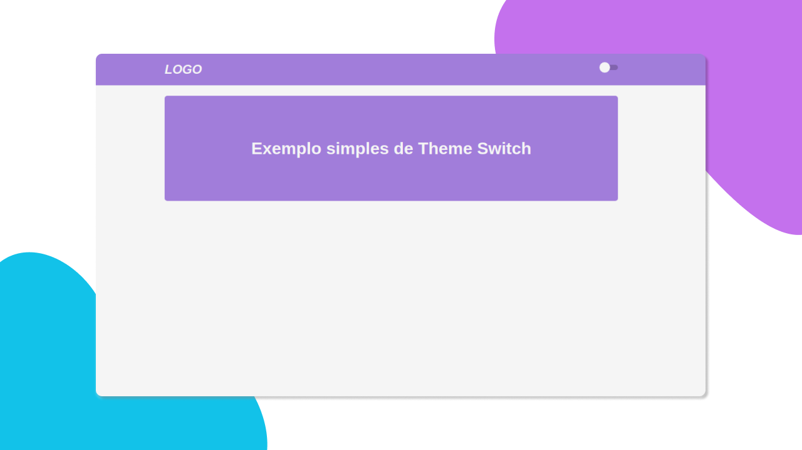

<h1 align="center">Theme Mode</h1>

  <a href="#-tecnologias">Tecnologias</a> &nbsp;&nbsp;&nbsp;|&nbsp;&nbsp;&nbsp;
  <a href="#-projeto">Projeto</a>&nbsp;&nbsp;&nbsp;|&nbsp;&nbsp;&nbsp;
  <a href="#-utilizar">Utilizar</a>&nbsp;&nbsp;&nbsp;|&nbsp;&nbsp;&nbsp;
  <a href="#memo-licença">Licença</a>

  

  

 

## 🚀️ Tecnologias

- HTML
- CSS
- ReactJS
- JavaScript

## 💻️ Projeto

Project construido para facilitar a troca de cores utilizando <a href="https://styled-components.com/">styled-component</a> e salvando no localStorage.

## 📜️ utilizar

- Clone o repositório.
- Execute `yarn` para instalar as dependencias.
- Execute `yarn start` para iniciar.

## :memo: Licença

Esse projeto está sob a licença MIT.

---

Feito com ♥ by Mardeson Pereira
